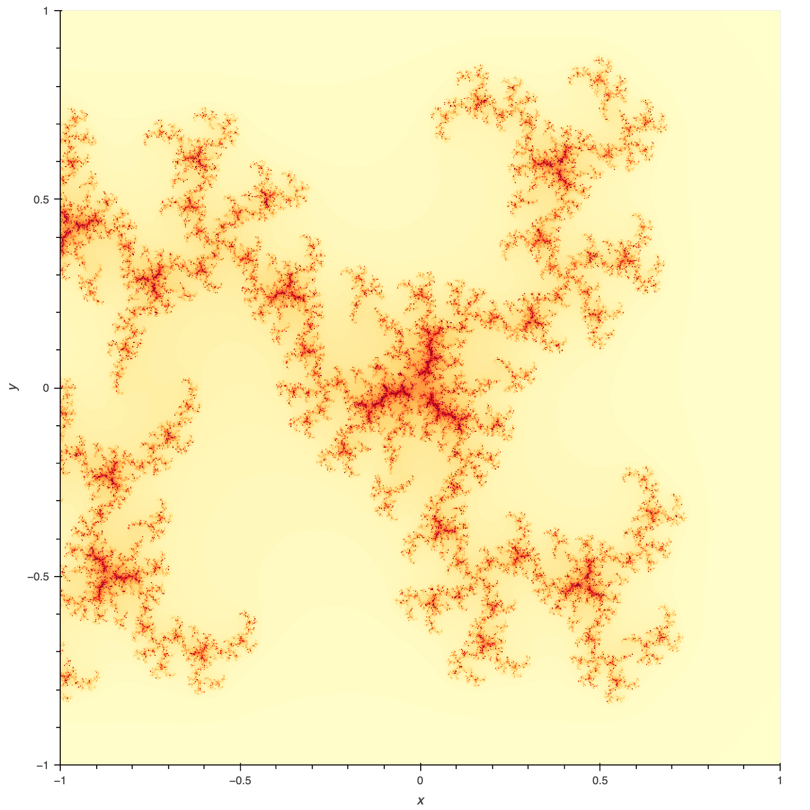
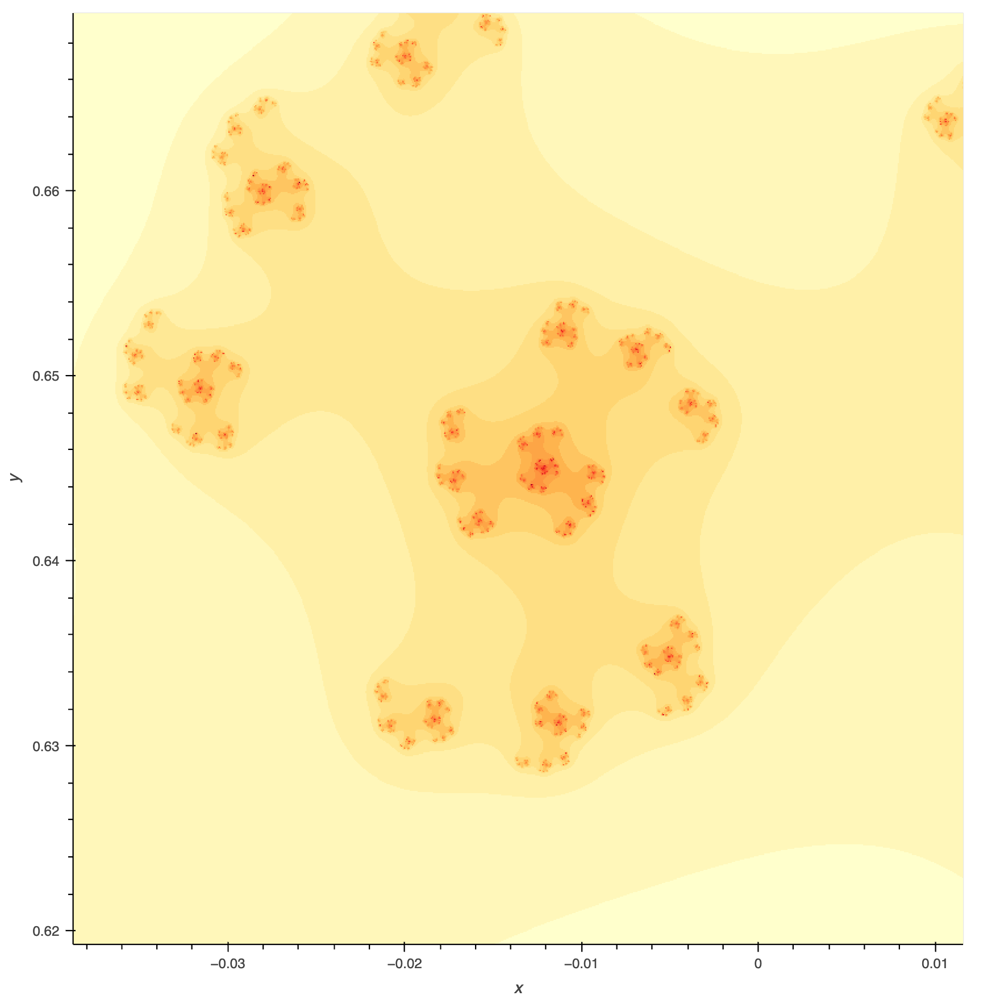

# Задача

Построить множество Жулиа для функции $z_{n+1} = z^4_n + z^3_n + c$

# Придумать заголовок

Множество Жулиа — это...

Множество Мондельброта — это...

holoviews динамически перестраивает изобржение

# В процессе выполнения было изученено

### Фракталы

- Множество Мондельброта
- Множество Жулиа
- Фрактал Ляпунова
- ДОПИСАТЬ

### Python

- njit, prange from numba
- holoviews

# Результат

### Множество Мондельброта
### Множество Жулиа

