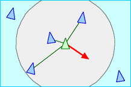
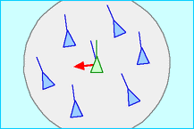
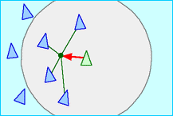

# О проекте

2D симуляция поведения косяка рыб или стаи птиц с использованием модели boids.

## Как работает модель boids

Между боидами есть три типа взаимодействия:

| Тип взаимодействия                                                                                                | Визуализация                         |
|-------------------------------------------------------------------------------------------------------------------|--------------------------------------|
| **Separation**: стремиться не находиться слишком близко к боидам в радиусе видимости.                             |  |
| **Alignment**: скорость к тому, чтобы скорость была сонаправлена со средней скоростью боидов в радиусе видимости. |    |
| **Cohesion**: стремиться двигаться центру масс боидов в радиусе видимости.                                        |      |

Эти три взаимодействия суммируются и образуют итоговое ускорение, с котором будет двигаться боид.

## Видео симмуляции

Позже появятся в нормальном виде, а пока ссылка на диск: [ссылка](https://disk.yandex.com/d/l6rszFGLOJeRyw)

## Реализованный функционал

- Алгоритм boids.
- Распараллелевание вычислений через `Numba`, что позволило иметь нормальный 60 FPS при 10000 боидов.
- Визуализация движения боидов через `VisPy`.
- Интерфейс со слайдерами и чекбоксами для изменения коэффициентов взаимодействия между боидами.
- Коллизия между боидом и стенами и облет стен — если боид приближается к стене, то он будет стараться не прикоснуться к ней.
- Зона, в которой один боид видит других, задается как сектор, направленный вдоль скорости с углом от 0 до 360 градусов.
- Цвет боида зависит от скорости движения.
- Возможность зума к одному боиду и следование камеры за этим боидом.