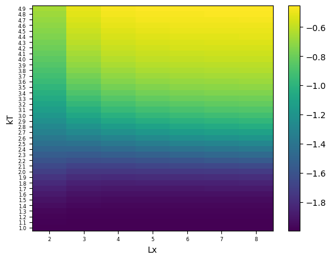

# О проекте

В данном проекте реализован алгоритм для вычисления нормализованного среднего значения энергии 2D ферромагнетика (молекулярной решетки) с использованием модели Изинга.

Для оптимизации вычислений используется распареллелевание через `Numba`, а также представление спинов как чисел в двоичной системе счисления и использование побитовых операций.

# Код

[Посмотреть код в Jupyter Notebook](task.ipynb)

# Результат

Значения нормализованной средней энергии при различных значениях температуры `kT` и различных размерах решетки `Lx`:

