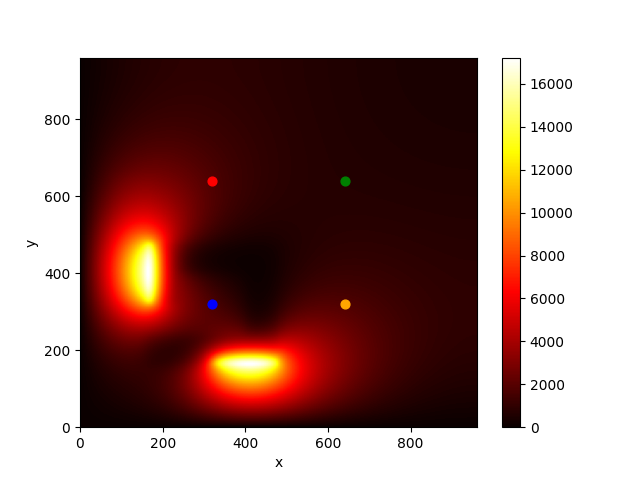

# О проекте

Симуляция нагревания металлической 2D пластины от двух источников тепла. Пластина состоит из двух различных материалов с разными коэффициентами диффузии.

Симуляция была построена для различных размеров изображения — чем больше разрешение, тем больше времени требовалось для вычислений. Для уменьшения времени вычислений использовалось распараллелевание вычислений через `Numba`.

# Код

[Посмотреть код в Jupyter Notebook](heat_transfer.ipynb)

# Результат

Симуляция нагрева:

Результат для пластины размера 960x960 спустя 600 секунд:

График, показывающий как менялась температура в четырех различных точках, зафиксированных на пластине:

